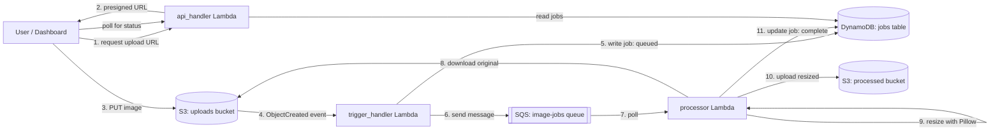

# pixel-pipeline

An event-driven, serverless image processing pipeline. Drop an image into an S3 bucket (via a web dashboard or directly), and it's automatically resized and stored — no server ever polls or waits; every step fires off the last one.

Built to go one level beyond a typical request/response CRUD project: this uses **decoupled, asynchronous architecture** (S3 event → queue → worker) instead of a single Lambda doing everything synchronously, and the entire infrastructure is provisioned with **Terraform** rather than manual console clicks.

## Architecture

## How it works

1. **Dashboard** (`frontend/index.html`) — requests a presigned upload URL from `api_handler`, then uploads the image directly to S3 from the browser (no file ever passes through a Lambda).
2. **`trigger_handler`** — fires automatically on every S3 upload via an S3 event notification. Writes a `queued` job record to DynamoDB and pushes a message to SQS. This is where the pipeline becomes asynchronous: the upload response returns immediately, without waiting for processing.
3. **SQS queue** — decouples the trigger from the actual processing work. If the processor is slow, backed up, or temporarily down, jobs simply wait in the queue instead of being lost or blocking the uploader.
4. **`processor`** — polls the queue, downloads the original image, creates a resized version with Pillow, uploads the result to a separate "processed" bucket, and updates the job status in DynamoDB (`complete` or `failed`, with an error message).
5. **`api_handler`** — the only Lambda the frontend talks to directly. Two actions: `get_upload_url` (generates a presigned S3 PUT URL) and `list_jobs` (reads job history from DynamoDB for the dashboard's status view).

## Why two S3 buckets, not one

Using separate uploads/processed buckets is a deliberate safety choice: if the processor wrote its output back into the same bucket that triggers it, every processed image would itself trigger another processing run — an infinite loop that can rack up real AWS costs before anyone notices. Two buckets make that structurally impossible.

## Tech stack

- **Terraform** — all infrastructure (S3, SQS, DynamoDB, 3 Lambdas, IAM roles, event wiring) defined as code, not clicked through the console
- **AWS Lambda** (Python 3.12) — three functions, each scoped to least-privilege IAM permissions
- **Amazon S3** — object storage, with event notifications and CORS configured for direct browser uploads
- **Amazon SQS** — decouples the upload trigger from the processing work
- **Amazon DynamoDB** — tracks job status (queued → processing → complete/failed)
- **Pillow** (via a Klayers-hosted Lambda layer, resolved dynamically at `terraform apply` time rather than a hardcoded version) — image resizing

## Safety & security

- **Least-privilege IAM** — each Lambda has its own role, scoped only to the exact actions and resources it needs (e.g. the trigger handler can write to DynamoDB and send to SQS, but cannot read/write S3 objects at all)
- **API key auth** — the `api_handler` Function URL rejects any request without a shared secret header
- **Separate buckets** — prevents the reprocessing-loop failure mode described above

## Project structure
pixel-pipeline/
├── terraform/
│ ├── main.tf # All infrastructure
│ ├── variables.tf
│ └── terraform.tfvars.example
├── lambda/
│ ├── trigger_handler/ # Fires on S3 upload, queues the job
│ ├── processor/ # Consumes queue, resizes image
│ └── api_handler/ # Presigned URLs + job listing for the frontend
└── frontend/
└── index.html # Upload dashboard + job status view

## Setup

1. Install [Terraform](https://developer.hashicorp.com/terraform/install) and configure the AWS CLI with credentials
2. Copy `terraform/terraform.tfvars.example` to `terraform/terraform.tfvars` and fill in a unique bucket suffix and an API secret
3. `cd terraform && terraform init && terraform apply`
4. Copy the `api_handler_url` output into `frontend/index.html` (the `API_URL` constant), along with your API secret (`API_KEY` constant)
5. Open `frontend/index.html` in a browser

## Notable gotchas hit while building this

- **S3 keys are URL-encoded in event notifications** — filenames with spaces arrive as `file+name.png` in the S3 event payload; the trigger handler must decode this (`urllib.parse.unquote_plus`) before using it as an actual S3 key, or downstream lookups silently fail.
- **Lambda Function URLs need two separate permissions** for unauthenticated public access — `lambda:InvokeFunctionUrl` *and* `lambda:InvokeFunction` — missing either produces a 403 even with the auth type set to `NONE`.
- **Klayers layer ARNs are versioned and region-specific** — rather than hardcoding one (which goes stale as new Pillow versions are published), this project resolves the current ARN dynamically via the `klayers` Terraform provider.

## Possible future work

- Automated tests (pytest) for the Lambda functions
- CI/CD to auto-apply Terraform changes on push
- Support additional transformations (thumbnails at multiple sizes, format conversion, watermarking)
- Replace polling-based status checks in the dashboard with WebSocket or SNS-based push updates

